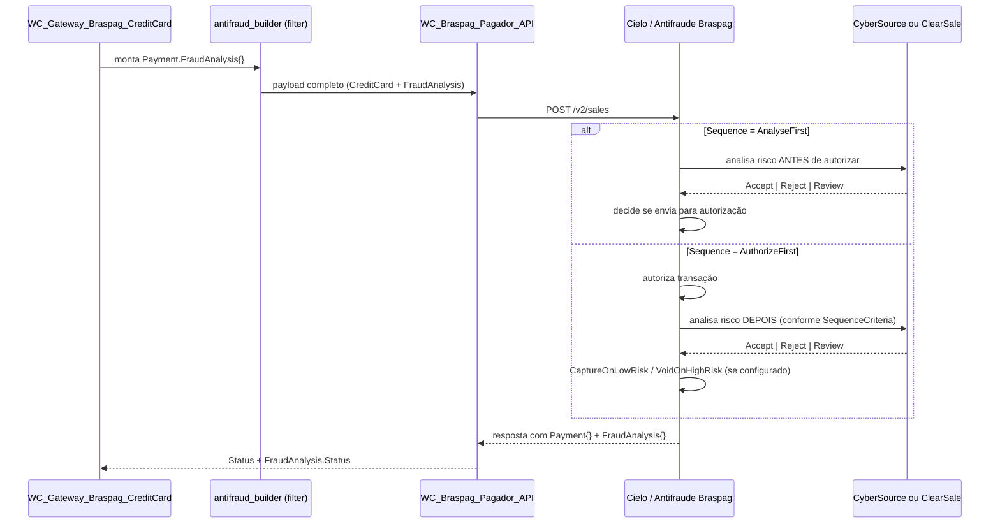

# ARD: Antifraude (CyberSource / ClearSale)
**Versão:** 1.0 | **Status:** Aprovado | **Data:** 2026-07-31 | **Autor:** agent-pm
**Tipo:** Architecture Requirements Document
**Linkado a:** `antifraude-prd.md`, `plugin-braspag-sdd.md`

---

## 1. Visão Geral da Arquitetura de Integração

O Antifraude Braspag é acionado dentro do fluxo padrão de criação de venda do Pagador (`WC_Braspag_Pagador_API::create_sale()`), via o nó `FraudAnalysis{}` embutido no mesmo payload de `/v2/sales`. Não é uma chamada HTTP separada do ponto de vista do plugin — a orquestração entre autorização e análise de risco é feita internamente pela Braspag/Cielo, controlada pelos parâmetros `Sequence` e `SequenceCriteria`.

O `WC_Braspag_Risk_API` (já existente no doc mestre, `plugin-braspag-sdd.md` §2.2) permanece reservado para o modo de **Antifraude via API separada** (fora do payload do Pagador). Este ARD cobre o modo **integrado ao Pagador**, que é o suportado pela API E-commerce Cielo descrita na documentação de referência.

---

## 2. Decisões Arquiteturais

### Decisão 1 — Antifraude embutido no payload do Pagador, não como chamada separada

**Contexto:** O plugin já possui `WC_Braspag_Risk_API` para um modo de Antifraude desacoplado do Pagador (usado por outros adquirentes/fluxos Braspag). A API E-commerce Cielo, no entanto, expõe o Antifraude como parte do mesmo payload de `create_sale()` (`Payment.FraudAnalysis{}`).

**Decisão:** Para a integração E-commerce Cielo (CyberSource/ClearSale), o Antifraude é montado via builder encadeado (`ADR-001` do doc mestre) dentro do payload de `create_sale()`, e não via `WC_Braspag_Risk_API`.

**Consequências:**
- (+) Reaproveita o padrão de builders já estabelecido (`..._antifraud_builder`, já citado no mestre §5.2)
- (+) Uma única chamada HTTP por venda — sem overhead de orquestração adicional no plugin
- (-) `WC_Braspag_Risk_API` permanece uma classe paralela para outros fluxos — não deve ser confundida com este modo

### Decisão 2 — Provider é configuração de loja, não decisão por transação

**Contexto:** `FraudAnalysis.Provider` aceita `"Cybersource"` ou `"ClearSale"` por requisição, mas a contratação com a Cielo é feita para um único provider por vez.

**Decisão:** O campo `antifraud_provider` é uma configuração global do gateway de crédito no admin WooCommerce, aplicada a todas as transações. Não há lógica de seleção dinâmica de provider por transação.

**Consequências:**
- (+) Simplicidade: uma única branch de código por instalação
- (-) Troca de provider exige reconfiguração manual do lojista (aceitável — reflete a realidade da contratação)

### Decisão 3 — Sequence/SequenceCriteria como matriz de decisão explícita

**Contexto:** A combinação de `Sequence` (`AnalyseFirst`/`AuthorizeFirst`) e `SequenceCriteria` (`OnSuccess`/`Always`) define 5 comportamentos de negócio distintos, documentados oficialmente pela Cielo.

| Sequence | SequenceCriteria | Comportamento |
|---|---|---|
| `AnalyseFirst` | — | Analisa risco antes de autorizar; evita autorizar transações de alto risco |
| `AuthorizeFirst` | — | Autoriza primeiro, analisa depois |
| `AuthorizeFirst` | `OnSuccess` | Só analisa se autorizada (evita custo de análise em transações negadas) |
| `AuthorizeFirst` | `Always` | Sempre analisa, independente do status de autorização |
| `AnalyseFirst` | `Always` | Sempre autoriza, independente do score de fraude |

**Decisão:** Os dois campos são expostos como configurações independentes no admin (`antifraud_sequence`, `antifraud_sequence_criteria`), e a validação de combinações inválidas/sem sentido (ex.: `CaptureOnLowRisk` sem `AuthorizeFirst`) é feita na camada de builder, não na UI do admin.

**Consequências:**
- (+) Flexibilidade total para o lojista replicar qualquer um dos 5 fluxos oficiais
- (-) Requer validação defensiva no builder para não gerar payload inconsistente com a doc oficial

### Decisão 4 — Fingerprint é responsabilidade client-side, independente do backend

**Contexto:** Ambos os providers exigem um identificador de dispositivo (`BrowserFingerprint`) gerado por script de terceiros no checkout: Threatmetrix para CyberSource, script próprio para ClearSale. Este identificador deve existir **antes** do submit do formulário de pagamento.

**Decisão:** A geração do fingerprint é feita inteiramente no frontend (JS enqueued condicionalmente conforme o provider configurado), e o valor resultante é injetado como hidden field, seguindo o mesmo padrão já usado para carteiras digitais (`ewallet-sdd.md` §5.1). O backend apenas recebe o valor pronto e o envia em `Payment.FraudAnalysis.Browser.BrowserFingerprint`.

**Consequências:**
- (+) Reaproveita o padrão de hidden fields + submit já validado no plugin
- (+) Backend não depende de SDKs externos de fingerprint
- (-) Checkout depende de script de terceiro carregar corretamente antes do submit — necessário fallback/timeout tratado no JS

### Decisão 5 — MDDs e Travel são exclusivos do provider CyberSource

**Contexto:** `MerchantDefinedFields[]` e `Travel{}` são nós específicos da integração CyberSource; não existem na integração ClearSale.

**Decisão:** O builder de Antifraude verifica o provider configurado antes de adicionar esses nós ao payload — nunca enviados quando `Provider = "ClearSale"`.

**Consequências:**
- (+) Evita payload inválido ou ignorado silenciosamente pela API
- (-) Lógica condicional adicional no builder (`if provider === Cybersource`)

---

## 3. Requisitos de Integração

| Item | Valor |
|---|---|
| Endpoint (mesmo do Pagador) | `POST /v2/sales/` (sandbox: `apisandbox.cieloecommerce.cielo.com.br`; produção: `api.cieloecommerce.cielo.com.br`) |
| Headers | `MerchantId`, `MerchantKey`, `Content-Type: application/json` (mesmos do doc mestre) |
| Campo obrigatório em toda transação com AF | `FraudAnalysis.Provider`, `FraudAnalysis.Sequence`, `FraudAnalysis.SequenceCriteria`, `FraudAnalysis.TotalOrderAmount`, `FraudAnalysis.Browser.BrowserFingerprint` |

---

## 4. Requisitos de Segurança e Compliance

- **LGPD:** o fingerprint coleta dados do dispositivo do comprador (localização, identificadores de publicidade, características de hardware/software, dados de rede/operadora). A documentação oficial exige que o lojista inclua essa coleta na política de cookies do e-commerce — este é um requisito de **conteúdo/configuração do lojista**, não uma implementação de código, mas o admin do plugin deve exibir um aviso lembrando dessa obrigação.
- **PCI-DSS:** nenhum dado de cartão adicional é exposto pelo Antifraude além do que já trafega em `CreditCard{}` — sem impacto adicional de escopo PCI.
- **Logs:** `BrowserFingerprint` e valores de `MerchantDefinedFields[]` não devem ser logados em claro — mascarar via `WC_Braspag_Logger`, mesmo padrão de `wallet_key` no `ewallet-sdd.md` §7.

---

## 5. Restrições Técnicas

- `BrowserFingerprint` tem validade de referência de ~24h (CyberSource/Threatmetrix) a ~48h (ClearSale) — deve ser gerado por sessão de checkout, nunca reaproveitado entre pedidos.
- `TotalOrderAmount` é obrigatório e deve refletir o valor total do pedido em centavos, mesmo quando igual a `Payment.Amount`.
- MDDs nunca devem ser enviados com valor vazio — campos sem dado disponível devem ser omitidos do array `MerchantDefinedFields[]`.
- `CaptureOnLowRisk` e `VoidOnHighRisk` só têm efeito com `Sequence = AuthorizeFirst` e `Payment.Capture = false` — o builder deve validar essa dependência e ignorar/alertar se configurado incorretamente.

---

## 6. ADRs Propostos

### ADR-009: Antifraude via builder encadeado no payload do Pagador

**Data:** 2026-07-31
**Status:** Proposto

**Contexto:** Reaproveitar o padrão de builders via WordPress filters (ADR-001) já usado para SOP, 3DS e e-wallets, em vez de introduzir uma nova camada de orquestração para o Antifraude E-commerce Cielo.

**Decisão:** Implementar `..._antifraud_builder` como mais um filter encadeado no `process_payment()` do gateway de crédito, populando `Payment.FraudAnalysis{}` (incluindo `Browser`, `Cart`, `MerchantDefinedFields`, `Travel` quando aplicável).

**Consequências:**
- (+) Consistência arquitetural com o restante do plugin
- (+) Extensível por terceiros via filter, sem modificar a classe do gateway
- (-) Builder cresce em complexidade condicional (provider-specific branches)

### ADR-010: Fingerprint via script condicional por provider

**Data:** 2026-07-31
**Status:** Proposto

**Contexto:** Cada provider usa um script de terceiro diferente para gerar o fingerprint (Threatmetrix vs. script ClearSale).

**Decisão:** O plugin enfileira o script correto (`wp_enqueue_script`) condicionalmente, com base em `antifraud_provider`, apenas quando o gateway de crédito com Antifraude estiver habilitado.

**Consequências:**
- (+) Evita carregar scripts desnecessários no checkout
- (-) Necessário testar troca de provider em ambiente de homologação antes de ir a produção (scripts diferentes, org_id/session_id diferentes)

---

## 7. Referências

- [Análise de Fraude — Visão Geral](https://docs.cielo.com.br/ecommerce-cielo/docs/analise-de-fraude)
- [Antifraude CyberSource — Referência API](https://docs.cielo.com.br/ecommerce-cielo/reference/af-cybersource)
- [Antifraude ClearSale — Referência API](https://docs.cielo.com.br/ecommerce-cielo/reference/af-clearsale)
- [Fingerprint CyberSource](https://docs.cielo.com.br/risco/docs/fingerprint-cybersource)
- [Fingerprint ClearSale](https://docs.cielo.com.br/risco/docs/fingerprint-clearsale)
