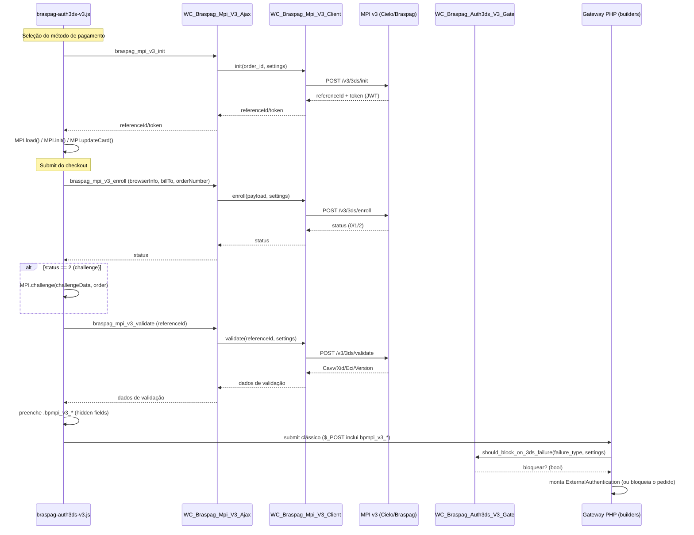

# Migração MPI v2 → MPI v3 (3DS Cielo/Braspag) - Especificação

## Metadata
- **Versão:** 1.0
- **Data:** 2026-09-22
- **Autor:** AI Agent (migração), a pedido do usuário
- **Status:** Implemented
- **Dependências:** `docs/specs/integrations/3ds-auditoria-2026-09-07.md`

## 🎯 Objetivo

Migrar a autenticação 3DS do checkout clássico (crédito e débito) do modelo **MPI v2 client-side** (biblioteca `BP.Mpi.3ds20.min.js` carregada no browser, resultado obtido via callbacks JS) para o **MPI v3 server-to-server** da Cielo/Braspag, no qual o merchant chama diretamente os endpoints backend `auth`, `init`, `enroll` e `validate`, recorrendo ao frontend apenas para carregar as libs Cardinal Commerce (`mpi.js`/`mpiHelpers.js`), sincronizar os dados do cartão e exibir o challenge ACS quando necessário.

A migração foi feita como **corte direto**: não há flag de versão nem fallback para v2 — todo o código client-side do MPI v2 foi removido do plugin. Crédito e débito migraram juntos, na mesma release.

Um segundo objetivo, de negócio, motivou parte do escopo: **o 3DS não funciona em conjunto com o SilentOrderPost (SOP)** — a validação de cada um deve ser feita separadamente — e por isso o plugin passou a impedir que os dois fiquem habilitados ao mesmo tempo.

**Fora de escopo:** Checkout Blocks (React). Os achados 3DS-01 a 3DS-06 da auditoria, específicos de Blocks, permanecem registrados como não tratados; uma eventual migração do Blocks para MPI v3 é um plano futuro separado.

## 🔧 Requisitos Funcionais

### RF001 - Cliente HTTP server-to-server MPI v3
**Descrição:** O plugin deve se comunicar com os 4 endpoints do MPI v3 (`auth/token`, `3ds/init`, `3ds/enroll`, `3ds/validate`) via um cliente HTTP dedicado, sem reutilizar o cliente v2.
**Prioridade:** Alta
**Critérios de Aceitação:**
- [x] `WC_Braspag_Mpi_V3_Client::get_access_token()` obtém e cacheia o `access_token` com TTL real (~18 min, com margem sobre os ~20 min documentados; usa `expires_in` da resposta quando presente).
- [x] `init()`, `enroll()`, `validate()` implementados e testados com HTTP mockado.
- [x] Erros HTTP 400/401 mapeados para `WC_Braspag_Exception` com mensagens amigáveis, sem expor o payload cru ao checkout.

**Formato do request de AUTH (`POST /v3/auth/token`) — atenção, diverge do OAuth2 client_credentials do MPI v2:**
```
Headers:
  Authorization: Basic <ClientId:ClientSecret em base64>
  Content-Type: application/json

Body (JSON):
{
    "EstablishmentCode": "...",
    "MerchantName": "...",
    "MCC": "..."
}
```
Não há `grant_type` no corpo nem `Content-Type: application/x-www-form-urlencoded` — essa era a assinatura do endpoint OAuth2 do MPI v2 (`WC_Braspag_Mpi_API::get_authorization()`), reaproveitada por engano na primeira versão do cliente v3 e corrigida em 2026-09-23 após causar `HTTP 415 Unsupported Media Type` em staging (erro "#MPI4" no checkout). `EstablishmentCode`/`MerchantName`/`MCC` vêm das configurações gerais já existentes (`establishment_code`, `merchant_name`, `mcc` em `includes/admin/braspag-settings.php`) — se qualquer um estiver vazio, `get_access_token()` lança `WC_Braspag_Exception` antes de tentar a requisição.

**Formato do request de INIT/ENROLL/VALIDATE — divergências descobertas em staging (2026-09-23), corrigidas nesta base:**
- `POST /v3/3ds/init`: exige `currency` no código **numérico** ISO 4217 (`"986"` para BRL — enviar `"BRL"` alfabético resulta em `{"Code":"Currency","Message":"Invalid currency code"}`). Constante `WC_Braspag_Mpi_V3_Client::CURRENCY_BRL_ISO`.
- `POST /v3/3ds/enroll`: exige o campo `totalAmount` (não `amount`) e o objeto `card` não-vazio com `cardNumber` (PAN real, não um token — o PAN já trafega por este mesmo backend na submissão clássica do pedido, então isso não amplia o escopo PCI já existente do plugin). O `billTo` usa `name` combinado (não `firstName`/`lastName` separados), `phoneNumber` (não `phone`), `street1`/`street2` (não `address1`/`address2`), `zipCode` (não `postalCode`) — nomes diferentes do builder do Pagador, não apenas casing. `currency` aqui usa o código **alfabético** (`"BRL"`, `WC_Braspag_Mpi_V3_Client::CURRENCY_BRL_ALPHA`) — diferente do `init`, que exige o numérico. A resposta da Cielo usa chaves PascalCase aninhadas: `Status` (não `status`), `Authentication.{Cavv,Xid,Eci,Version}`, `Challenge.{AcsUrl,Pareq,TransactionId}` (só quando `Status=2`), `Reason.{Code,Message}` — ver `WC_Braspag_Mpi_V3_Ajax::extract_authentication_data()`.
- `POST /v3/3ds/validate`: **não** recebe só um `referenceId` (como a primeira versão assumia) — exige `orderNumber`/`currency`/`totalAmount`/`transactionId` (o `Challenge.TransactionId` devolvido pelo enroll quando `Status=2`) e o objeto `card` de novo. Só deve ser chamado após um challenge resolvido; quando `enroll` já retorna `Status=1`, o resultado final (Cavv/Xid/Eci/Version) já vem na própria resposta do enroll, sem precisar de `validate`.
- Casing dos nomes de campo é tolerado como case-insensitive pela API (confirmado empiricamente: `orderNumber`/`currency` em camelCase foram aceitos onde a doc mostra exemplos em outro casing) — os bugs reais eram nomes de campo **diferentes** (`amount` vs `totalAmount`, `firstName`/`lastName` vs `name`) ou valores ausentes/no formato errado, não apenas diferença de maiúscula/minúscula.

### RF002 - Fluxo frontend do checkout clássico
**Descrição:** O checkout clássico (crédito e débito) deve executar o fluxo completo `init → updateCard → enroll → challenge (se status=2) → validate` antes de liberar o submit do pedido.
**Prioridade:** Alta
**Critérios de Aceitação:**
- [x] `MPI.load()`/`MPI.init()`/`MPI.updateCard()` disparados na seleção do método de pagamento (evento `change` em `#payment_method_braspag_{creditcard,debitcard}`), replicando o timing do `startTransaction()` do v2 para não atrasar o clique de "Finalizar pedido".
- [x] `enroll` → `challenge` (quando status=2) → `validate` disparados no submit do formulário, bloqueando o submit até a resolução.
- [x] Campos hidden `.bpmpi_v3_{cavv,xid,eci,version,reference_id,failure_type}` preenchidos após `validate` e consumidos pelos builders PHP via `$_POST`.
- [x] Número do cartão nunca trafega para o backend do merchant durante `updateCard` (tokenização client-side via Cardinal).

### RF003 - Builders de payload (crédito e débito)
**Descrição:** Os builders que montam o nó `ExternalAuthentication` para a Pagador API devem consumir os dados do fluxo v3 e preservar as opções configuráveis de "autorizar apesar de falha/não-enrollment/bandeira não suportada".
**Prioridade:** Alta
**Critérios de Aceitação:**
- [x] Builder de crédito reescrito para os campos `bpmpi_v3_*`.
- [x] Builder de débito reescrito, corrigindo os bugs 3DS-07 (comparação truthy-sempre-`true`), 3DS-08 (switch sem `default`) e 3DS-09 (ausência de gate de bloqueio) — nenhum herdado do v2.
- [x] Lógica de bloqueio (`should_block_on_3ds_failure`) extraída para uma classe compartilhada (`WC_Braspag_Auth3ds_V3_Gate`), eliminando a duplicação divergente entre crédito e débito.

### RF004 - Incompatibilidade SOP × 3DS
**Descrição:** O 3DS (agora sempre v3) e o SilentOrderPost não podem ficar habilitados simultaneamente.
**Prioridade:** Alta (requisito de negócio explícito)
**Critérios de Aceitação:**
- [x] Aviso visual (`notice notice-warning`) nas 3 telas de admin envolvidas (geral, crédito, débito), atualizado dinamicamente via JS sem reload.
- [x] Campo conflitante desabilitado visualmente na UI quando o outro já está ativo.
- [x] Garantia real via `WC_Gateway_Braspag::process_admin_options()`: ao salvar SOP=yes com 3DS já ativo (ou vice-versa), o campo mais recente é forçado para `no` e um erro é registrado via `WC_Admin_Settings::add_error()` — funciona mesmo contornando a UI (POST direto).

## ⚙️ Requisitos Não-Funcionais

### RNF001 - Segurança de log (fecha 3DS-10/3DS-11)
**Descrição:** Nenhuma chamada ao MPI v3 pode logar `client_secret`, `access_token` ou dados de cartão em texto puro.
**Implementação:** `WC_Braspag_Mpi_V3_Client::redact_sensitive()` mascara recursivamente todo o contexto antes de passar para `WC_Braspag_Logger::log()` — `access_token` mantém só os 4 primeiros caracteres, demais campos sensíveis viram `***`.

### RNF002 - Cache de token com TTL real (fecha 3DS-12)
**Descrição:** O `access_token` não pode ser reutilizado após expirar.
**Implementação:** `set_transient()`/`get_transient()` com TTL de ~18 minutos (ou `expires_in - 2min` quando a API retorna esse campo), substituindo o cache anterior via `WC()->session->set()` sem expiração efetiva.

### RNF003 - Compatibilidade retroativa de configuração
**Descrição:** Não introduzir novos campos de credenciais no admin.
**Implementação:** O MPI v3 reaproveita as credenciais OAuth já cadastradas (`auth3ds20_oauth_authentication_client_id`/`_secret`) e as opções `auth3ds20_mpi_authorize_on_*` já existentes.

## 🏗️ Design Técnico

### Arquitetura



### Classes envolvidas

| Classe/Arquivo | Papel |
|---|---|
| `includes/class-wc-braspag-mpi-v3-client.php` | Cliente HTTP dos 4 endpoints v3 (auth/init/enroll/validate), cache de token, redaction de log, tratamento de erros 400/401. |
| `includes/class-wc-braspag-mpi-v3-ajax.php` | Endpoints AJAX (`braspag_mpi_v3_{init,enroll,validate}`) que a ponte JS↔PHP usa, com verificação de nonce. |
| `includes/class-wc-braspag-auth3ds-v3-gate.php` | Lógica de bloqueio compartilhada entre crédito e débito (`should_block()`), fecha 3DS-07/08/09. |
| `assets/js/braspag-auth3ds-v3.js` | Driver client-side (`bpmpi`): `init`/`updateCard` na seleção do método, `enroll`→`challenge`→`validate` no submit. |
| `includes/class-wc-gateway-braspag.php` | Registro dos scripts `Scripts/V3/{mpi,mpiHelpers}.js` e dos hidden fields `.bpmpi_v3_*`; bloqueio de UI/admin SOP×3DS (`process_admin_options()`). |
| `includes/payment-methods/class-wc-gateway-braspag-{creditcard,debitcard}.php` | Builders `braspag_pagador_*_payment_request_auth3ds20_builder()` consumindo `bpmpi_v3_*` e o gate compartilhado. |
| `includes/admin/braspag-{settings,creditcard-settings,debitcard-settings}.php` | Avisos visuais SOP×3DS nas 3 telas de configuração. |

### Removido nesta migração

- `includes/class-wc-braspag-mpi-api.php` (`WC_Braspag_Mpi_API`, cliente v2).
- `assets/js/braspag-auth3ds20.js`, `assets/js/braspag-auth3ds20-renderer.js`.
- `assets/js/vendor/auth3ds20/BP.Mpi.3ds20.conf.js`, `BP.Mpi.3ds20.lib.js` (este último já era código morto antes da migração — achado 3DS-19).
- Métodos `braspag_mpi_request()` e `get_mpi_auth_token()` de `includes/abstracts/abstract-wc-braspag-payment-gateway.php` (dependiam do cliente v2).
- `tests/js/3ds/auth3ds20-blocks-null-safe.test.js` (carregava diretamente o arquivo v2 removido e tratava de Checkout Blocks, fora de escopo).

## 🔄 Fluxos de Processo

### Fluxo principal (sucesso, sem challenge)
1. Cliente seleciona cartão de crédito/débito no checkout → JS dispara `init`/`updateCard`.
2. Cliente clica em "Finalizar pedido" → JS dispara `enroll`.
3. `enroll` retorna status=1 (autenticado) → JS dispara `validate` diretamente.
4. `validate` retorna Cavv/Xid/Eci → JS preenche os hidden fields e libera o submit.
5. PHP monta `ExternalAuthentication` no builder e envia para a Pagador API.

### Fluxo com challenge
1-2. Igual ao principal.
3. `enroll` retorna status=2 → JS chama `MPI.challenge(challengeData, order)`, exibindo o iframe do ACS.
4. Challenge resolvido → JS dispara `validate`.
5. Segue igual ao fluxo principal a partir do passo 4.

### Fluxos alternativos
- **status=0 (não autenticado):** decisão de prosseguir ou bloquear o pedido segue as opções já existentes `auth3ds20_mpi_authorize_on_unenrolled`/`_on_error`/`_on_failure`/`_on_unsupported_brand`, avaliadas por `WC_Braspag_Auth3ds_V3_Gate::should_block()`.
- **Erro de conexão/timeout no `init`/`enroll`/`validate`:** `WC_Braspag_Exception` lançada com mensagem amigável; o checkout não trava silenciosamente.
- **Tentativa de habilitar SOP com 3DS ativo (ou vice-versa) no admin:** bloqueado tanto por JS (UX) quanto por `process_admin_options()` (garantia real, resistente a POST direto).

## 🧪 Cobertura de Testes

| Camada | Arquivo | Cobertura |
|---|---|---|
| Unit | `tests/unit/class-wc-braspag-mpi-v3-client-test.php` | Auth com sucesso, cache de token com TTL, expiração, erros 400/401 de cada endpoint, ausência de segredos no log. |
| Unit | `tests/unit/class-wc-braspag-auth3ds-v3-gate-test.php` | Sem falha, cada `failure_type` conhecido (authorize_on_* yes/no), `failure_type` desconhecido (fail-closed, fecha 3DS-08), override de produção não-Cielo. |
| Integration | `tests/integration/sop-3ds-mutual-exclusion-test.php` | SOP bloqueando 3DS (crédito e débito), 3DS bloqueando SOP, ambos desativados sem bloqueio. |

**Execução verificada em 2026-09-22 (DDEV, PHP 8.3):**
- `vendor/bin/phpunit -c phpunit.xml.dist` (unit): 22/22 testes, 52 assertions — OK.
- Suíte de integração (via `.wp-tests-lib`/`.wp-tests-core` já instalados localmente, com WooCommerce e Extra Checkout Fields for Brazil carregados manualmente no bootstrap): 7/7 testes, 9 assertions — OK.

**Pendência conhecida de infraestrutura de CI:** não há `composer.json` versionado no repositório (achado 3DS-24 da auditoria) — o script `composer test:integration` referenciado em `.github/workflows/php-tests.yml` não executa hoje. A suíte de integração só pôde ser validada localmente com um bootstrap WP customizado; recomenda-se versionar um `composer.json` mínimo (ou um bootstrap de integração dedicado em `tests/integration/bootstrap.php`) para que o CI rode essa suíte de fato.

**Não coberto por este trabalho:** testes E2E/Playwright com cartões sandbox reais end-to-end (exigem ambiente WP completo + credenciais sandbox); testes de Checkout Blocks (fora de escopo).

## 🔗 Integrações

### APIs Externas
- **MPI v3 (Cielo/Braspag):** `auth/token`, `3ds/init`, `3ds/enroll`, `3ds/validate` — sandbox `mpisandbox.braspag.com.br/v3/`, produção `mpi.braspag.com.br/v3/`.
- **Scripts Cardinal Commerce:** `Scripts/V3/mpi.js`, `Scripts/V3/mpiHelpers.js`.
- **Braspag Pagador API:** consome o nó `ExternalAuthentication` montado pelos builders após `validate`.

### WordPress/WooCommerce
- Hooks AJAX: `wp_ajax_braspag_mpi_v3_{init,enroll,validate}` / `wp_ajax_nopriv_braspag_mpi_v3_{init,enroll,validate}`.
- `wp_localize_script('braspag_auth3ds_v3_params', ...)` para expor `ajaxUrl`, nonces e flags `isBpmpiEnabledCC`/`isBpmpiEnabledDC` ao JS.
- `WC_Settings_API`/`process_admin_options()` para a validação server-side do bloqueio SOP×3DS.

## 🔒 Considerações de Segurança

- `access_token` nunca exposto ao frontend; só o `token` (JWT) retornado por `init` é seguro para expor.
- Número do cartão nunca trafega para o backend do merchant (tokenização client-side via `MPI.updateCard()`).
- Todo log do cliente v3 passa por `redact_sensitive()` antes de `WC_Braspag_Logger::log()` (RNF001).
- Nonce do WordPress obrigatório em todos os 3 endpoints AJAX.

## 🚀 Critérios de Entrega

- [x] RF001-RF004 implementados.
- [x] RNF001-RNF003 atendidos.
- [x] Testes unitários e de integração criados e passando (ver seção de cobertura).
- [x] Código v2 removido (checklist de grep confirmado antes de cada delete pelos agentes executores).
- [x] Documentação atualizada (este documento + índice em `docs/specs/README.md`).
- [ ] Testes de aceitação manuais em sandbox com os cartões de teste documentados pela Cielo (sem challenge sucesso/falha, com challenge sucesso/falha, DataOnly) — recomendado antes do deploy em produção, não executado neste trabalho por exigir navegador real.
- [ ] `composer.json` versionado para destravar `composer test:integration` no CI (ver pendência na seção de testes).

## 📚 Referências

- Documentação oficial: [Cielo Gateway Docs - MPI v3](https://docs.cielo.com.br/gateway/docs/mpi-v3)
- Auditoria anterior (MPI v2 client-side): `docs/specs/integrations/3ds-auditoria-2026-09-07.md`
- Plano de implementação original: commits `af0d8af`, `cc6edd6`, `5cf8685` na branch `feat/mpi-3DS-v3`

### Achados da auditoria — status pós-migração

| Achado | Descrição | Status |
|---|---|---|
| 3DS-01 | Race condition `await bpmpi_authenticate()` nos Blocks | Não aplicável ao checkout clássico (nunca ocorreu ali); Blocks fora de escopo, achado permanece aberto |
| 3DS-07 | `Authenticate` sempre `true` no débito | **Fechado** — comparação estrita no builder v3 |
| 3DS-08 | Switch de `failure_type` sem `default` no débito | **Fechado** — `WC_Braspag_Auth3ds_V3_Gate` fail-closed para tipo desconhecido |
| 3DS-09 | Builder de débito sem gate de bloqueio | **Fechado** — gate compartilhado aplicado nos dois builders |
| 3DS-10 | `client_secret`/`merchant_key` em log texto puro | **Fechado na base v3** — `redact_sensitive()` em todo log do cliente v3 |
| 3DS-11 | Token/corpo de requisição logados em texto puro | **Fechado na base v3** — mesmo mecanismo de redaction |
| 3DS-12 | Cache de token sem TTL real | **Fechado** — `set_transient()` com TTL de ~18min |
| 3DS-19 | `BP.Mpi.3ds20.lib.js` código morto | **Fechado** — arquivo removido nesta migração |
| 3DS-21 | `BRASPAG_API_VERSION` declarada e nunca usada | **Fechado** — classe inteira (`WC_Braspag_Mpi_API`) removida |
| 3DS-24 | `composer.json` não versionado, CI de integração não roda | **Ainda aberto** — ver pendência nesta spec |
| 3DS-02 a 3DS-06, 3DS-13 a 3DS-18, 3DS-20, 3DS-22, 3DS-23 | Diversos, específicos de Blocks ou de baixo risco não relacionados diretamente à migração | Não tratados neste trabalho (fora de escopo ou baixa prioridade) |
