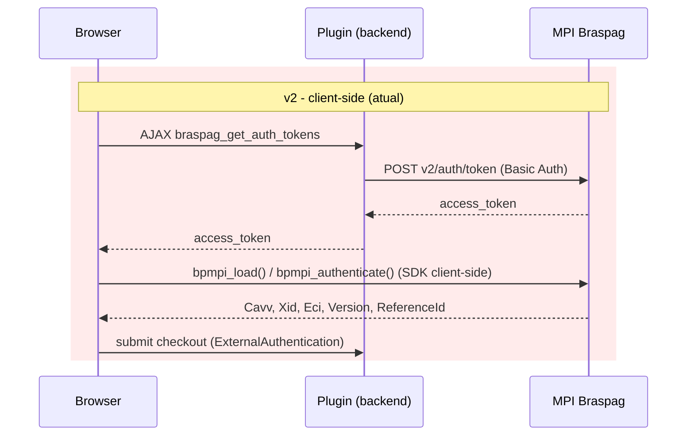
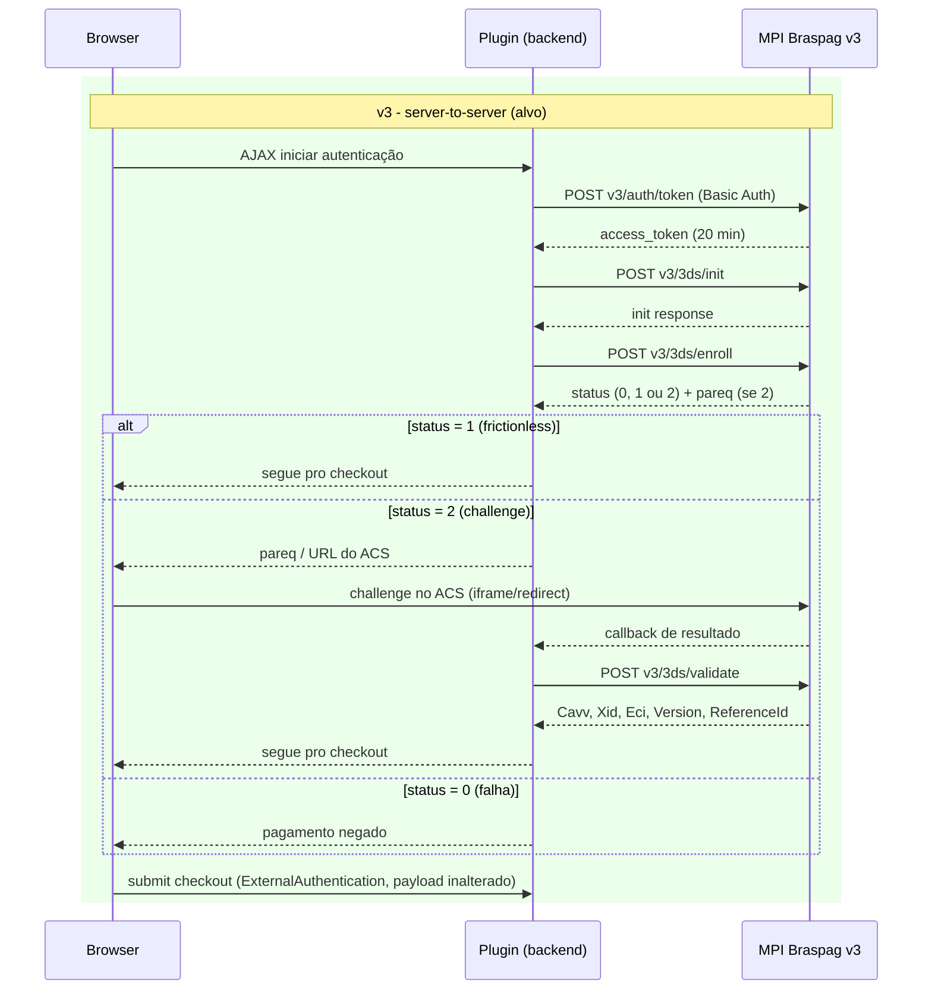
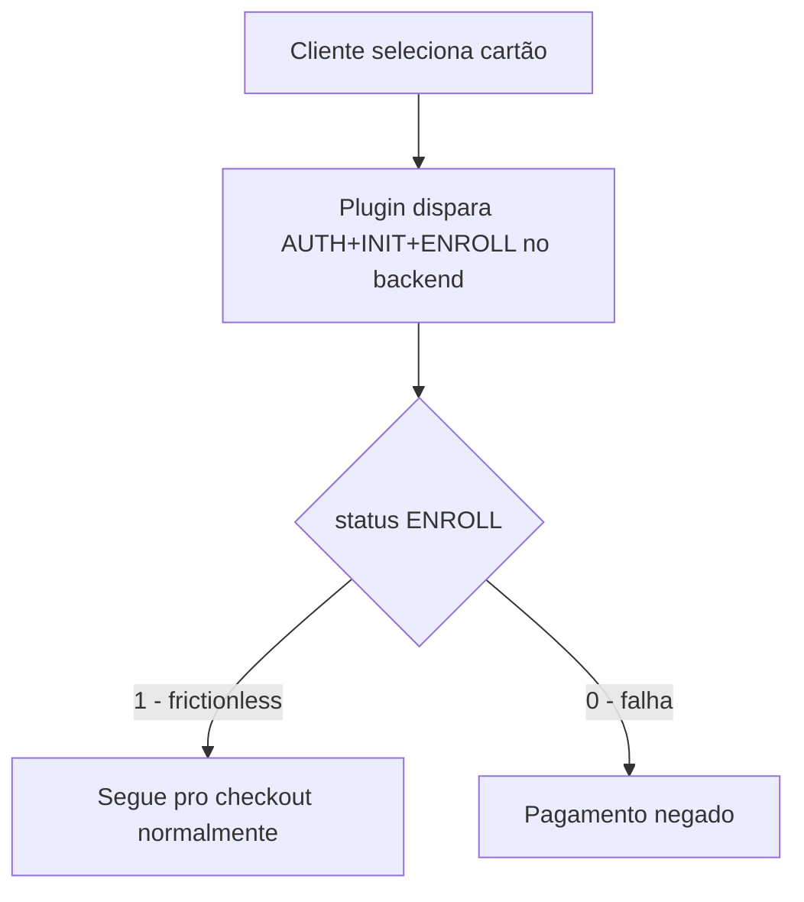
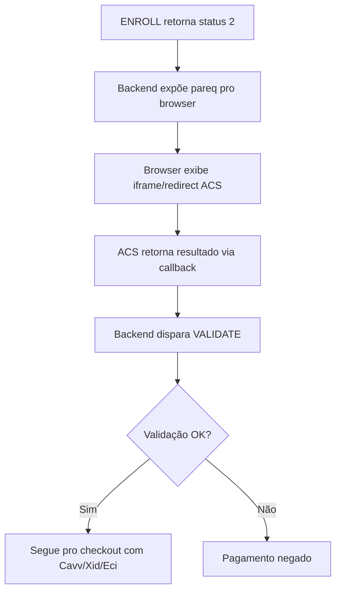

# Migração MPI v2 → v3 (Autenticação 3DS) - Especificação

## Metadata
- **Versão:** 1.0
- **Data:** 2026-08-24
- **Autor:** AI Agent
- **Status:** Draft
- **Dependências:** `3ds-authentication.spec.md` (se existir), `braspag-api.spec.md` (se existir)

## 🎯 Objetivo

Migrar a autenticação 3DS do plugin, hoje implementada com o MPI **v2** (arquitetura client-side, SDK Braspag carregado no browser), para o MPI **v3** (arquitetura exclusivamente server-to-server), sem alterar o contrato já existente com a Sale API de crédito/débito (`ExternalAuthentication`).

## 📍 Estado Atual (MPI v2)

Confirmado em código:

- `includes/class-wc-braspag-mpi-api.php` (`WC_Braspag_Mpi_API`): client HTTP genérico para `mpi.braspag.com.br` / `mpisandbox.braspag.com.br`, Basic Auth (`base64(client_id:client_secret)`), `BRASPAG_API_VERSION = '2020-02-10'`.
- `includes/abstracts/abstract-wc-braspag-payment-gateway.php:521` (`get_mpi_auth_token()`): chama `v2/auth/token` com `EstablishmentCode`/`MerchantName`/`MCC`, devolve só um `access_token`.
- `includes/class-wc-braspag-auth-tokens-ajax.php`: endpoint AJAX `braspag_get_auth_tokens` entrega esse `access_token` para o browser sob demanda.
- `assets/js/braspag-auth3ds20.js` + `assets/js/vendor/auth3ds20/BP.Mpi.3ds20.lib.js`: todo o enroll/challenge roda no browser via `bpmpi_load()` / `bpmpi_authenticate()`; o SDK devolve `Cavv`/`Xid`/`Eci`/`Version`/`ReferenceId` em campos hidden, que o form de checkout injeta no payload de venda.
- `includes/class-wc-braspag-3ds-return-codes.php`: classifica return codes 3DS (`100`, `475`/`476`, `MPI6xx`/`MPI9xx`, etc.) documentados em `docs.cielo.com.br/gateway/docs/return-codes-3ds`.

O código atual carrega, inclusive, débito técnico conhecido: comentários `[BP-DEBUG]` em `assets/js/braspag-auth3ds20.js` mostram investigação em andamento de uma condição de corrida onde `ExternalAuthentication` chega nulo — sintoma típico de depender de um SDK client-side assíncrono fora do controle do merchant. A migração para v3 elimina essa classe de bug ao mover a orquestração inteira para o servidor.

## 🔧 Requisitos Funcionais

### RF001 - Orquestração server-to-server do fluxo MPI v3
**Descrição:** Implementar as 4 chamadas obrigatórias e sequenciais da API MPI v3, feitas exclusivamente pelo backend do plugin.
**Prioridade:** Alta
**Critérios de Aceitação:**
- [ ] `AUTH` — `POST /v3/auth/token`, Basic Auth (`base64(ClientId:ClientSecret)`), obtém `access_token` (validade 20 min)
- [ ] `INIT` — `POST /v3/3ds/init`, executado após AUTH
- [ ] `ENROLL` — `POST /v3/3ds/enroll`, executado após INIT
- [ ] `VALIDATE` — `POST /v3/3ds/validate`, executado somente quando ENROLL retornar `status=2`
- [ ] Chamadas fora de ordem ou repetidas não são disparadas pelo cliente (a própria API v3 bloqueia, mas o orquestrador deve evitar round-trips desnecessários)
- [ ] `access_token` nunca é enviado ao browser, em nenhuma etapa

### RF002 - Tratamento dos status de ENROLL
**Descrição:** Tratar corretamente os 3 resultados possíveis do ENROLL.
**Prioridade:** Alta
**Critérios de Aceitação:**
- [ ] `status=1` (frictionless): segue direto para a Sale API, sem exibir challenge
- [ ] `status=2` (challenge): dispara VALIDATE e exibe/redireciona o comprador para o ACS usando o `pareq` retornado
- [ ] `status=0` (falha de autenticação): pagamento é negado antes de chegar na Sale API, com log e mensagem genérica ao cliente
- [ ] Cada status é logado com o mesmo nível de detalhe que hoje existe em `WC_Braspag_Logger`

### RF003 - Renderização do challenge sem SDK client-side
**Descrição:** Substituir o SDK Braspag (`BP.Mpi.3ds20.lib.js`) por uma implementação própria que exiba o iframe/redirect do ACS a partir do `pareq`.
**Prioridade:** Alta
**Critérios de Aceitação:**
- [ ] `assets/js/vendor/auth3ds20/BP.Mpi.3ds20.lib.js` é removido
- [ ] `assets/js/braspag-auth3ds20.js` não chama mais `bpmpi_load()`/`bpmpi_authenticate()`
- [ ] Novo fluxo JS chama o endpoint AJAX do plugin para iniciar a autenticação e recebe de volta: frictionless (segue) ou challenge (URL/payload do ACS pra exibir)
- [ ] Layout do challenge (iframe ou redirect) é compatível com o checkout clássico e com Checkout Blocks (`includes/blocks/payments/*`)

### RF004 - Compatibilidade com a Sale API existente
**Descrição:** Garantir que o payload final enviado para a Sale API de crédito/débito não muda.
**Prioridade:** Alta
**Critérios de Aceitação:**
- [ ] `ExternalAuthentication{Cavv,Xid,Eci,Version,ReferenceId,DataOnly}` continua sendo montado e enviado do mesmo jeito
- [ ] Nenhuma mudança é necessária em `includes/payment-methods/class-wc-gateway-braspag-creditcard.php` / `class-wc-gateway-braspag-debitcard.php` além de onde os dados de autenticação são obtidos (client-side → resultado do backend)
- [ ] Ordem "3DS autentica primeiro, SOP tokeniza depois" (hoje documentada em `assets/js/braspag-auth3ds20.js`) é preservada

### RF005 - Migração dos return codes
**Descrição:** Revisar/estender `WC_Braspag_3ds_Return_Codes` para os códigos retornados pelos novos endpoints v3.
**Prioridade:** Média
**Critérios de Aceitação:**
- [ ] Mapa de códigos revisado contra `docs.cielo.com.br/gateway/docs/return-codes-3ds` para eventuais códigos novos/removidos em v3
- [ ] Códigos desconhecidos continuam caindo em `UNKNOWN` sem quebrar o fluxo

## ⚙️ Requisitos Não-Funcionais

### RNF001 - Segurança
- [ ] `access_token` do MPI nunca trafega para o browser (elimina o padrão atual do endpoint AJAX que hoje expõe o token para o SDK)
- [ ] Nenhum dado sensível de cartão é enviado num payload que trafegue fora do backend do plugin

### RNF002 - Compatibilidade
- [ ] Funciona tanto no checkout clássico quanto em Checkout Blocks
- [ ] `test_mode` continua selecionando sandbox (`mpisandbox.braspag.com.br`) vs produção (`mpi.braspag.com.br`)

### RNF003 - Observabilidade
- [ ] Cada uma das 4 chamadas (AUTH/INIT/ENROLL/VALIDATE) é logada individualmente via `WC_Braspag_Logger`, como já ocorre hoje para o fluxo v2

## 🏗️ Design Técnico

### Fluxo v2 (atual) vs v3 (alvo)

### Componentes a criar/modificar/remover

**Backend**
- `includes/class-wc-braspag-mpi-api.php` — trocar endpoint base/versão; adicionar métodos para INIT/ENROLL/VALIDATE reaproveitando `get_headers()`/`get_authorization()` (já fazem Basic Auth).
- `includes/abstracts/abstract-wc-braspag-payment-gateway.php:521` (`get_mpi_auth_token`, `braspag_mpi_request`) — vira orquestrador do fluxo completo, com verificação de estado antes de cada chamada.
- `includes/class-wc-braspag-auth-tokens-ajax.php` — deixa de devolver `access_token` puro; passa a "iniciar autenticação" (dispara INIT/ENROLL no server) e devolve só o necessário para decidir frictionless vs challenge.
- Novo handler para receber o callback do ACS e completar o VALIDATE.
- `includes/class-wc-braspag-3ds-return-codes.php` — revisão do mapa de códigos (RF005).

**Frontend**
- Remover `assets/js/vendor/auth3ds20/BP.Mpi.3ds20.lib.js`.
- Reescrever `assets/js/braspag-auth3ds20.js`: troca `fetchAuthTokens → bpmpi_load → bpmpi_authenticate` por chamada ao novo endpoint AJAX + tratamento de frictionless/challenge.
- Revisar `assets/js/braspag-auth3ds20-renderer.js` (`BpmpiRenderer`): mantém os campos hidden que alimentam `ExternalAuthentication`; remove os que só existiam para configurar o SDK client-side.

## 🔄 Fluxos de Processo

### Fluxo Principal - Autenticação v3 sem Challenge

### Fluxo com Challenge

## 🧪 Cenários de Teste

Usando os cartões de teste documentados pela Cielo para MPI v3:

### Teste 1: Autenticação Frictionless (sem challenge)
**Given:** Cartão de teste `4000000000002701` (Visa)
**When:** Cliente inicia checkout com cartão de crédito
**Then:**
- ENROLL retorna `status=1`
- Nenhum challenge é exibido
- `ExternalAuthentication` é preenchido e enviado normalmente pra Sale API
- Pedido segue fluxo normal de aprovação

### Teste 2: Autenticação com Challenge obrigatório
**Given:** Cartão de teste `4000000000002503` (Visa)
**When:** Cliente inicia checkout
**Then:**
- ENROLL retorna `status=2` com `pareq`
- Challenge é exibido (iframe/redirect ao ACS)
- Após conclusão, VALIDATE é chamado e retorna `Cavv`/`Xid`/`Eci`
- Pedido segue fluxo normal de aprovação

### Teste 3: Falha de Autenticação
**Given:** Cartão de teste `4000000000002925` (Visa)
**When:** Cliente inicia checkout
**Then:**
- ENROLL retorna `status=0`
- Pagamento é negado antes de chegar na Sale API
- Log registra motivo da falha
- Cliente vê mensagem de erro genérica

### Teste 4: access_token nunca exposto ao browser
**Given:** Qualquer fluxo de autenticação em andamento
**When:** Inspeciona-se o tráfego de rede do browser
**Then:**
- Nenhuma resposta AJAX contém o `access_token` do MPI v3
- Apenas dados necessários para renderizar/decidir o challenge trafegam para o cliente

### Teste 5: Regressão - Débito e Checkout Blocks
**Given:** Fluxo migrado para v3
**When:** Processa pagamento via cartão de débito e via Checkout Blocks
**Then:**
- Resultado de autenticação é aplicado corretamente em ambos os fluxos
- `ExternalAuthentication` chega à Sale API com os mesmos campos de antes

### Teste 6: Regressão - Ordem 3DS → SOP
**Given:** SOP (tokenização) habilitado junto com 3DS
**When:** Pagamento é processado
**Then:**
- 3DS autentica primeiro, SOP tokeniza depois, only then o form é submetido — mesma ordem documentada hoje em `braspag-auth3ds20.js`

## 🔗 Integrações

### APIs Externas

#### MPI v3 (Braspag)
- **AUTH:** `POST /v3/auth/token` — Basic Auth, retorna `access_token` (20 min)
- **INIT:** `POST /v3/3ds/init`
- **ENROLL:** `POST /v3/3ds/enroll` — retorna `status` (0/1/2)
- **VALIDATE:** `POST /v3/3ds/validate` — só quando `status=2`
- **Sandbox:** `https://mpisandbox.braspag.com.br/v3/...`
- **Produção:** `https://mpi.braspag.com.br/v3/...`

#### Sale API (Cielo/Braspag Pagador) — inalterada
- Crédito: `docs.cielo.com.br/gateway/reference/credito-api`
- Débito: `docs.cielo.com.br/gateway/reference/debito-api`
- Campo `ExternalAuthentication{Cavv,Xid,Eci,Version,ReferenceId,DataOnly}` sem mudanças

### WordPress/WooCommerce
- Endpoint AJAX `braspag_get_auth_tokens` (reaproveitado, com contrato de resposta alterado)
- Checkout Blocks: `includes/blocks/payments/class-wc-braspag-blocks-creditcard.php`, `class-wc-braspag-blocks-debitcard.php`

## 🔒 Considerações de Segurança

- `access_token` do MPI v3 é de uso exclusivo do backend — nunca deve ser incluído em respostas AJAX, HTML ou logs em texto puro.
- O `pareq`/dados de challenge expostos ao browser devem ser o mínimo necessário para renderizar o ACS.
- Manter os return codes 3DS fora de mensagens de erro visíveis ao cliente (mensagem genérica, log detalhado apenas server-side) — já é a prática atual em `WC_Braspag_3ds_Return_Codes`.

## 📊 Métricas e Monitoramento

- Taxa de frictionless vs challenge (status 1 vs 2) — útil para avaliar impacto na conversão do checkout.
- Taxa de falha de autenticação (status 0).
- Log de cada uma das 4 chamadas AUTH/INIT/ENROLL/VALIDATE, com tempo de resposta.

## 🚀 Critérios de Entrega

### ✅ Desenvolvimento
- [ ] Fluxo AUTH→INIT→ENROLL→VALIDATE implementado no backend
- [ ] SDK client-side (`BP.Mpi.3ds20.lib.js`) removido
- [ ] Novo fluxo de challenge implementado no frontend
- [ ] `ExternalAuthentication` continua sendo montado sem mudanças de payload

### ✅ Segurança
- [ ] Validado que `access_token` nunca chega ao browser
- [ ] Revisão de que nenhum dado sensível trafega fora do backend

### ✅ Testes
- [ ] `tests/unit/Api/MpiApiTest.php` e `tests/unit/Api/ThreeDsReturnCodesTest.php` atualizados
- [ ] `tests/js/3ds/*.test.js` atualizados para o novo fluxo
- [ ] Regressão completa: crédito, débito, checkout blocks, antifraude (`tests/integration`, `tests/e2e`)

### ✅ Documentação
- [ ] Este spec revisado e aprovado
- [ ] Runbook de troubleshooting atualizado (se existir) para os novos endpoints v3

## 📚 Referências

- [MPI v3 - Overview](https://docs.cielo.com.br/gateway/docs/mpi-v3)
- [Crédito API](https://docs.cielo.com.br/gateway/reference/credito-api)
- [Débito API](https://docs.cielo.com.br/gateway/reference/debito-api)
- [Return Codes 3DS](https://docs.cielo.com.br/gateway/docs/return-codes-3ds)

## ⚠️ Riscos e Pendências

- **Prazo de sunset da v2:** não há changelog público confirmando data de desativação da MPI v2. Confirmar com o time/gerente de conta Cielo antes de comprometer um cronograma de corte.
- **Certificação de challenge UI:** bandeiras (Visa/Mastercard) podem exigir validação da interface de challenge quando ela passa a ser controlada pelo merchant (hoje delegada ao SDK Braspag).
- **Formato exato do callback do ACS:** a doc pública consultada não detalha o schema completo de callback pós-challenge; deve ser confirmado em sandbox real antes de fechar o design do handler de callback.
- **Débito técnico atual:** `assets/js/braspag-auth3ds20.js` já carrega instrumentação de debug (`[BP-DEBUG]`) investigando uma condição de corrida em `ExternalAuthentication` nulo no fluxo v2 — evidência de que a arquitetura client-side atual é frágil, reforçando a motivação de negócio para a migração.

## 💰 Estimativa de Esforço

Baseada em regressão completa (crédito + débito + checkout blocks + antifraude):

| Fase | Estimativa |
|---|---|
| Descoberta técnica com Cielo/Braspag (sunset v2, credenciais sandbox v3, schema do callback ACS) | 2-3 dias |
| Backend: orquestração AUTH→INIT→ENROLL→VALIDATE + endpoint de callback | 5-8 dias |
| Frontend: remoção do SDK vendor, novo fluxo de challenge/redirect | 4-6 dias |
| Config admin (campos novos, se necessário) | 1 dia |
| Testes unitários + JS | 2-3 dias |
| Regressão manual/QA (crédito, débito, blocks, antifraude, E2E) | 4-5 dias |
| Buffer para achados do sandbox real | 3-5 dias |
| **Total** | **~21-31 dias úteis (1 dev)** |

---

## 📝 Histórico de Alterações

| Versão | Data       | Autor | Alterações |
|--------|------------|-------|------------|
| 1.0    | 2026-08-24 | AI    | Criação inicial da especificação |

---

**Próximos Steps:**
1. Validar com Cielo/Braspag: prazo de sunset da v2, credenciais sandbox v3, schema do callback do ACS.
2. Review técnico deste spec com o time.
3. Após aprovação, gerar plano de implementação detalhado (skill `writing-plans`).
