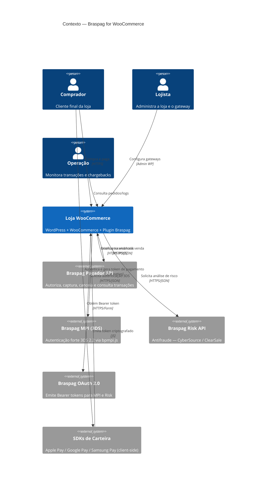
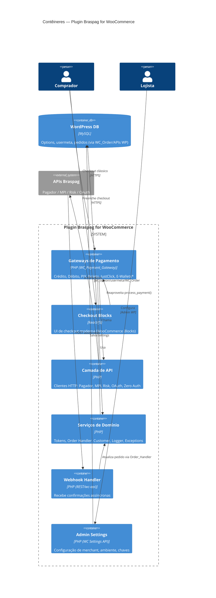
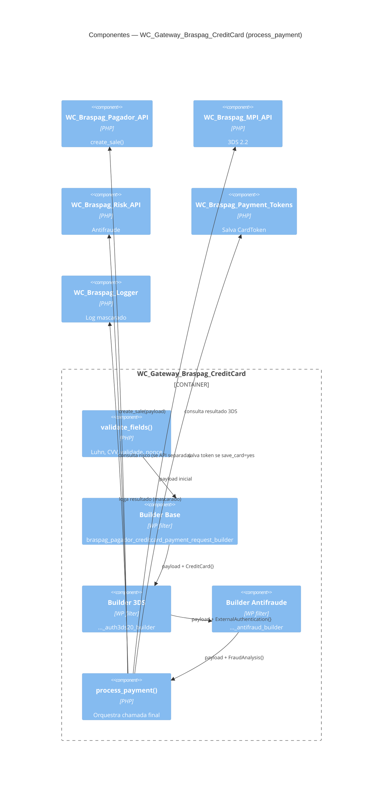

# Modelo C4 — Braspag for WooCommerce
**Versão:** 1.0 · **Data:** 2026-08-26

## Nível 1 — Contexto do Sistema

## Nível 2 — Contêineres

*E-Wallets: contêiner de spec aprovada, código ainda não presente em `includes/`.*

## Nível 3 — Componentes (Gateway de Cartão de Crédito)

## Nível 4 — Código (opcional, referência)

Ver classes e assinaturas detalhadas em [03-SDD.md](03-SDD.md) §2 e §6 (convenções de nomes). Não repetido aqui para evitar duplicação — nível de código deve ser lido diretamente do PHPDoc de cada classe em `includes/`.
